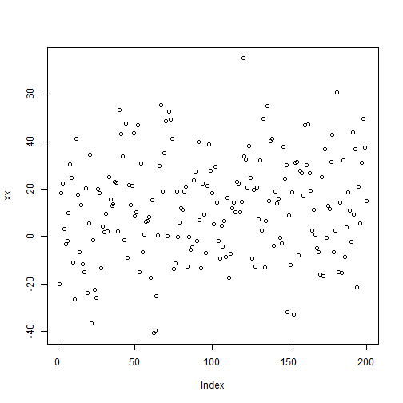

# RStudio Test Document
## Testing RStudion to GitHub Connection
========================================

Here is a brief report of some trivial calculations I made simply to test the
process of writing up analysis in R Markdown and sending the resulting files
to my GitHub account.  

So this should be a new paragraph.  

**And this should now be bold**, *and this italicized*.

Here's a little formula:  $E = MC^{2}$

And here is some astounding code:

```r
xx <- rnorm(200,12,20)
length(xx)
```

```
## [1] 200
```

### Plotting Section
And now let's have a plot of xx:
 

```r
plot(xx)
```

 
And xx/3:

```r
plot(xx/3)
```

 


 And that is all I have for today!
